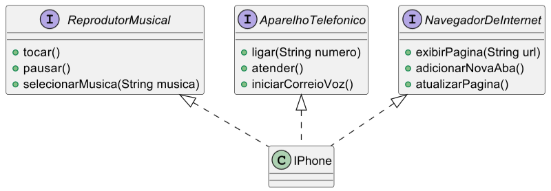

# Diagrama UML do Iphone

O arquivo foi escrito utilizando a sintaxe PlantUML. 
É possível visualizar o diagrama utilizando plugins da sua IDE:
- [PlantUML Integration](https://plugins.jetbrains.com/plugin/7017-plantuml-integration) - IntelliJ
- [PlantUML](https://marketplace.visualstudio.com/items?itemName=jebbs.plantuml) - VSCode

## Imagem
